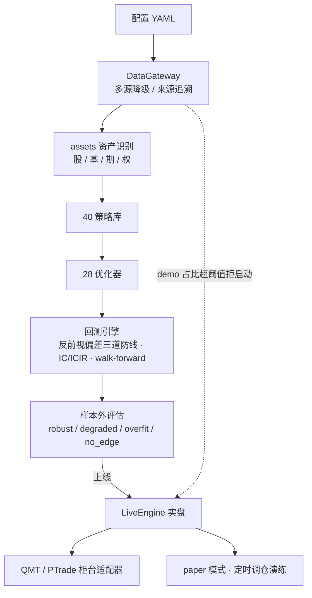

# Lianghua Quant · 多资产量化交易框架

模仿 **vnpy / Backtrader / qtrader** 设计的轻量、模块化、可插拔本地量化平台。
目标是像搭积木一样组合「数据 → 策略 → 回测 → 风控 → 绩效 → UI」。

> 设计取舍：核心回测引擎用纯 Pandas 实现（零重依赖、可立即运行），
> 同时保留 `backtrader_adapter.py` 作为可选适配层，复用成熟生态。
> **已覆盖股票 / 基金 / 期货 / 期权 四类可量化资产。**

## 灵感来源（已调研）

| 项目 | 类型 | 借鉴点 |
|------|------|--------|
| vnpy | 国内标杆·事件驱动 | 接口层/引擎层/应用层分层 |
| Backtrader | 经典事件驱动 | Strategy / DataFeed / Cerebro / Analyzer |
| qtrader | 轻量可插拔 | DataGateway / Strategy / Portfolio / Risk 关注点分离 |
| Qlib / RD-Agent | AI 量化 | 自动因子挖掘（已落地 `factor/` 模块） |
| 聚宽 / 米筐 / BigQuant | 云端平台 | 数据 API + 回测 + 风控 + 实盘一体化 |

## 支持资产

| 资产 | symbol 示例 | 专属引擎 | 关键特性 |
|------|------------|----------|----------|
| 股票 | `600519.SH` | `BacktestEngine` | 现金全额、T+1、佣金+印花税 |
| 基金 | `110011.OF` | `FundBacktest` / `DCABacktest` | 净值申赎、定投(DCA)、申赎费 |
| 期货 | `RB2410.SHF` | `FutureEngine` | 保证金、杠杆、多空、逐日盯市 |
| 期权 | `510050C3000.SH` | `OptionBacktest` | Black-Scholes 定价、Greeks、权利金结算 |

## 架构

```
UI(Streamlit, 多资产切换) → 策略 → 统一回测调度器(runner) → 风控 → 绩效 → 数据网关(SQLite缓存)
                                                    └→ 各资产专属引擎(股票/基金/期货/期权)
```

| 层 | 目录 | 职责 |
|----|------|------|
| 核心层 | `lianghua/core/` | 资产类型、合约规格、自动路由 |
| 数据层 | `lianghua/data/` | 多源网关、四类资产演示数据、缓存 |
| 策略层 | `lianghua/strategy/` `lianghua/option/strategy.py` | 股票/期货/期权策略基类与示例 |
| 回测层 | `lianghua/backtest/` | 股票/基金/期货/期权引擎 + 统一调度器(runner) + 多资产编排器(orchestrator) + Backtrader 适配 |
| 风控层 | `lianghua/risk/` | 按资产类别差异化：杠杆/保证金/权利金/止损 |
| 绩效层 | `lianghua/perf/` | 夏普、回撤、年化、基准对比、多资产归因 |
| 执行层 | `lianghua/execution/` | 模拟撮合（期货保证金冻结/期权行权/基金申赎） |
| 期权定价 | `lianghua/option/` | Black-Scholes 定价 + 希腊字母 + 隐含波动率 |
| UI 层 | `lianghua/ui/` | Streamlit 多资产仪表盘（红涨绿跌） |

## 快速开始

**零基础？先看 [`QUICKSTART.md`](QUICKSTART.md)** —— 一条命令跑完回测，并告诉你结果可不可信：

```bash
python tools/quickstart.py --demo   # 用演示数据，断网也能跑
```

```bash
pip install -r requirements.txt

# 四类资产回测（无网络时用内置演示数据）
python examples/run_backtest.py --symbol 600519.SH   --strategy sma_cross          # 股票
python examples/run_backtest.py --symbol 110011.OF   --asset fund   --strategy dca  # 基金定投
python examples/run_backtest.py --symbol RB2410.SHF  --asset future  --strategy breakout  # 期货
python examples/run_backtest.py --symbol 510050C3000.SH --asset option --strategy option_call_trend  # 期权

# 自动因子挖掘（AI 因子，RD-Agent 风格）
python examples/run_factor.py --symbol 600519.SH --top 5

# 真实数据全资产回测（四类资产，断网自动降级演示，标注 source）
python examples/run_live_backtest.py

# 遍历全部已注册策略做对比回测（统一策略注册表驱动）
python examples/run_all_strategies.py 600519.SH stock
# 遍历全部已注册优化器求解权重（统一优化器注册表驱动）
python examples/run_portfolio_optimizers.py 5

# 启动可视化终端（默认 http://localhost:8501，侧边栏含软件 Logo）
streamlit run lianghua/ui/app.py
# 或 python start.py / python -m lianghua / 双击 run.bat（中文名入口 启动量化终端.bat）/ 运行 ./run.sh
```

**项目官网**：`site/index.html` —— 单文件、零依赖，双击即可离线打开。
含终端界面演示、能力总览、可靠性工程说明与竞品对比。改版前先读下方「网站设计规范」。

## 内置策略

- 股票/基金/期货通用：`sma_cross`(双均线) / `macd`(MACD) / `momentum`(动量) / `breakout`(通道突破) / `mean_reversion`(均值回归)
- 基金专属：`dca`(定期定额)
- 期权专属：`option_call_trend`(买购趋势) / `option_put_hedge`(买沽对冲) / `option_straddle`(跨式突破)

## 测试

```bash
python tests/test_all_assets.py     # 10/10 通过：四类资产 + 风控 + 执行 + 归因 + 期权缓存 + 可插拔 Broker + 因子搜索
python tests/test_iter22_30.py      # 9/9 通过：VaR/滚动绩效/篮子/期权组合/期货套利/基金筛选/向量化/IO/信号推送
python tests/test_platform.py       # 平台集成：统一编排器 + 网关来源追溯 + UI 15 页无头渲染
python tests/test_iter31_100.py     # 迭代 31–100 集成：70 项断言覆盖全部新模块（离线桩数据）
python tests/test_integration_full.py  # 统一接入骨架：策略注册表(20)+优化器注册表(17)+编排器(优化器/报告)+能力索引
python tests/test_iter101_130.py    # 迭代 101–130：10 指标+10 策略+5 优化器+绩效/风险/因子函数+能力计数(30/22/18)
python tests/test_iter131_140.py    # 迭代 131–140：5 策略+2 优化器+绩效/风险/因子函数+自驱动缺口生成器(35/24/18)
python tests/test_iter141_150.py    # 迭代 141–150：5 策略(达40)+4 优化器(达28)+factor_icir+自驱动缺口(已划掉新项)
python tests/test_iter151_180.py    # 迭代 151–180：8 指标+10 绩效+9 风险分解+3 因子+能力计数(26/52/43/20)+自驱动封顶
```

## 第三轮扩展能力（迭代 11–30：研究平台化）

> 在原有框架基础上新增 20 个能力模块，把 lianghua 从「回测引擎」推进为「可用研究平台」。

### 组合与配置

| 模块 | 能力 |
|------|------|
| `portfolio/optimizer.py` | 组合优化器：等权 / 逆波动 / 风险平价（不动点迭代）/ 均值方差 / 凯利 |
| `portfolio/rebalance.py` | 定期再平衡 + 回撤止损（跌破阈值冻结权益） |
| `portfolio/allweather.py` | 全天候配置（股/债/商品/现金，默认逆波动权重） |
| `backtest/portfolio_backtest.py` | 多策略组合回测 + 成分归因 |
| `strategy/ensemble.py` | 策略集成器（加权信号合成） |

### 回测加速与方法

| 模块 | 能力 |
|------|------|
| `backtest/vectorized.py` | 纯 pandas 向量化回测（5000 根 K 线 ~3ms，engine 的加速替代） |
| `optimize/param_search.py` | 网格搜索 + Walk-forward 参数优化 |
| `backtest/montecarlo.py` | 自助法 / 参数法蒙特卡洛净值模拟与分位 |
| `backtest/basket.py` | 多标的篮子组合回测（自动资产路由 + 权重归因） |
| `backtest/future_spread.py` | 期货跨期套利（同品种近远月价差 z-score 均值回归） |

### 风险与绩效

| 模块 | 能力 |
|------|------|
| `risk/var.py` | VaR / CVaR（历史法 + 参数法）+ 风险金额报告 |
| `risk/cost.py` | 交易成本模型（佣金/印花税/滑点/冲击），四资产预设 |
| `perf/rolling.py` | 滚动夏普 / 波动 / 年化 / 最大回撤时间序列 |

### 因子与信号

| 模块 | 能力 |
|------|------|
| `factor/layer.py` | 因子 IC / IC 衰减 / 分位数多空收益 / 分层报告 |
| `signal/engine.py` | 规则化信号引擎（多策略事件合成） |

### 期权 / 基金 / 执行

| 模块 | 能力 |
|------|------|
| `option/strategy.py` | 期权组合策略：垂直价差 / 铁鹰 / 蝶式 + 到期损益曲线 |
| `fund/screener.py` | 基金多因子筛选（动量/波动/回撤/夏普加权排名） |
| `execution/notify.py` | 实盘信号推送：本地日志 + Webhook（requests 可选，降级安全） |
| `io/__init__.py` | 数据导入导出：CSV（核心）+ Excel（可选 openpyxl） |
| `strategy/intraday.py` | 分钟线 / 日内策略（突破 / VWAP 均值回归） |
| `report/__init__.py` | 回测 HTML 报告（净值曲线 SVG + 指标卡 + 成交表 + 蒙特卡洛） |

### 快速示例

```python
from lianghua.backtest.basket import basket_backtest
from lianghua.risk.var import var_report
from lianghua.option.strategy import butterfly, payoff_curve

# 篮子组合回测（自动按 symbol 路由股票/基金/期货/期权）
res = basket_backtest([{"symbol":"600519.SH","weight":0.5},
                       {"symbol":"510300.SH","weight":0.5}],
                      "2023-01-01","2023-12-31")
print(res["metrics"])

# 风险度量
print(var_report(res["daily_returns"], notional=1_000_000))

# 期权蝶式损益曲线
legs = butterfly("CALL", 90, 100, 110, 1.0, 4.0, 1.0)
print(payoff_curve(legs, 80, 120))
```

## 第四轮整合（都做：编排 + 真实数据 + 多页面 UI）

> 把研究平台能力真正"用起来"：一键编排、真实行情链路、可视化终端。

### 1. 统一编排器（`backtest/orchestrator.py`）
- `run_plan(plan, init_cash, gw)`：一份「多资产 + 多策略」研究计划 → 逐标的回测 → 按权重合并净值 → 组合绩效 + 成分明细。
- `run_backtest` 新增 `gw` 注入参数，编排器/离线验证可复用同一数据网关。
- 终端「统一编排(多资产)」页：填 `代码,资产,策略,权重` 一行一标的，一键出组合净值与归因。

### 2. 真实网络数据全资产回测（数据网关增强）
- `data/gateway.py` **四类资产均尝试真实源**（此前仅股票）：AKShare 对接股票 `stock_zh_a_hist`、ETF `fund_etf_hist_em`、开放式基金 `fund_open_fund_info_em`、期货 `futures_main_sina`。
- 新增**超时保护**（默认 15s，线程隔离）：网络不可用/接口变更/卡顿 → 自动降级演示数据，绝不卡死。
- 缓存表新增 **`source` 列**（akshare / baostock / demo / csv），数据来源可追溯、真实/演示诚实标注。
- 一键脚本：`python examples/run_live_backtest.py`（输出四类资产回测表 + `live_backtest_result.csv`）。

### 3. 多页面 Streamlit 终端（`ui/app.py`）
- 侧边栏「功能导航」9 页（第五轮扩展至 **15 页**）：单标的回测 / 组合·篮子回测 / 统一编排 / 期权组合策略 / 期货跨期套利 / 基金筛选 / 风险度量 VaR / 向量化回测 / 信号推送 / Monte Carlo / 参数优化 / HTML报告 / 策略库 / 组合优化 / 因子研究。
- 复用红涨绿跌配色与暗色主题；期权页含垂直价差/铁鹰/蝶式损益曲线，基金页含多因子排名柱状图。
- 启动：`streamlit run lianghua/ui/app.py`（默认 http://localhost:8501），或 `python start.py` / `python -m lianghua`。

## 第五轮扩展能力（迭代 31–100：平台深化 + 一键启动 + 模块进 UI）

> 把平台能力从 30 个模块扩展到 100 个迭代，补齐「一键启动」并把更多研究模块接入可视化终端。

### 1. 期权真实源升级（网关）
- `data/gateway.py` 期权源由失效的 `option_sina_*_hfq` 迁移为可用接口：
  1. 优先真实期权日线 `option_sse_daily_sina`（真实期权价）；
  2. **退化链路**：真实标的 ETF 日线 `fund_etf_hist_em` + Black-Scholes 模型生成期权价与希腊字母（真实标的路径锚定）；
  3. 任一失败 → 自动降级本地演示数据（含 BS 定价 + Greeks）。
- `core/assets.py` `get_contract_spec` 对「非标准期权格式 + asset=option」输入（如直接传 `510050.SH`）自动退化为平值 CALL 期权，离线/真实链路均不再崩溃。

### 2. 新增策略与指标（迭代 31–38, 61–72）
- 策略（共 30+）：turtle 海龟 / RSI / 布林 / 网格 / 均值回归(z-score) / 轮动 / 目标波动 / 双重动量 / 配对 / Kalman 对冲 / 唐奇安 / Keltner / Coppock / 季节 / 波动突破 / RSI 背离 / 抛物线 SAR / 自适应波动切换 / OU 均值回归 / ML 信号（sklearn 可选，降级动量）等。
- 指标库 `indicators/tech.py`：RSI / MACD / KDJ / BOLL / ATR / CCI / OBV / VWAP（纯 pandas，零依赖）。

### 3. 风险 / 绩效 / 组合 扩展（迭代 39–60）
- 风险：`budget`(风险平价/目标预算 ERC)、`stress`(压力测试)、`liquidity`(Amihud 非流动性)、`drawdown`(回撤序列)、`beta`(CAPM β/α)、`correlation`(相关性矩阵/滚动)、`position_sizing`(Kelly/固定分数)、`stop_loss`/`take_profit`/`limit_order`(跟踪止损/止盈档/限价撮合)。
- 绩效：`attribution`(Brinson)、`trade_stats`、`monthly`(月度表)、`benchmark`(IR/跟踪误差)、`sortino`(Sortino/Calmar/Omega)、`dist`(偏度/峰度/VaR)、`annualize`、`bootstrap`(自助法置信区间)、`rolling_corr`、`contrib`(收益贡献)。
- 组合：`min_variance` / `max_diversification` / `hrp`(分层风险平价) / `black_litterman` / `target_vol` / `cppi`(CPPI 保本) / `risk_parity_ewm`(EWM 风险平价) / `clustering`(聚类配置)。

### 4. 信号 / 因子 / 执行 / 数据 / 事件（迭代 73–100）
- 信号：`score`(复合分数) / `meta`(多数表决/加权元) / `scheduler`(再平衡日程) / `rank`(排名→仓位)。
- 因子：`zscore`(缩尾/中性化)、`returns`(因子多空/IC)。
- 执行：`sim_order`(模拟撮合) / `slippage`(滑点成交价) / `risk_check`(交易前风控)。
- 数据：`resample`(周/月线聚合) / `feature_store`(特征 SQLite) / `universe`(指数成分)。
- 回测/事件：`multi_strategy`(多策略合成) / `event_study`(事件研究)。
- 报告：`export_all`(CSV/HTML 导出) / `tearsheet`(绩效一页纸)。
- 其他：`regime`(波动率区制) / `ml_signal`(ML 信号) / `vectorized`(向量化回测对齐修复)。

### 5. 一键启动文件
- `start.py`：`python start.py [--port 8501] [--host 127.0.0.1] [--no-browser]`
  - 默认只监听本机；需要局域网内其它设备访问时显式加 `--host 0.0.0.0`。
  - 会自动挑选一个真正装了 streamlit 的解释器（当前 python → 项目 venv → PATH），
    找不到解释器或端口被占用时给出明确提示而不是报 `No module named streamlit`。
- `run.bat` / `run.sh`：Windows / Git Bash / Linux / macOS 双击或命令行启动（转调 `start.py`，可透传参数）
  - 可用环境变量 `LIANGHUA_PYTHON=<解释器路径>` 指定解释器。
- `启动量化终端.bat`：中文名双击入口，内部转调 `run.bat --daemon`（后台守护模式：服务脱离本窗口独立运行，
  关闭窗口不影响服务；正文保持纯 ASCII —— `.bat` 里同时出现 `chcp 65001` 和多字节中文会让 cmd.exe
  解析器按字节偏移读取时失步，把注释片段当命令执行而启动失败）
- `停止量化终端.bat`：停止后台守护服务（优先按 `terminal.pid` 杀进程树，兜底按 8501 端口找监听进程）；
  同样保持纯 ASCII，与 `启动量化终端.bat --daemon` 配对使用。
- `lianghua/__main__.py`：`python -m lianghua` 直接拉起终端

> 换行符由 `.gitattributes` 锁定：`*.sh` 强制 LF、`*.bat` 强制 CRLF。否则在
> `core.autocrlf=true`（Git for Windows 默认）的机器上 clone 出来的 `.sh` 会带 CRLF，
> shebang 变成 `#!/usr/bin/env bash\r`，Git Bash / Linux 上直接报 bad interpreter。

### 6. 更多模块接入 UI（15 页终端）
在原有 9 页基础上新增 6 页，导航共 **15 页**：
- Monte Carlo 模拟（`backtest/montecarlo`）
- 参数优化（`optimize/param_search`）
- HTML 报告（`report/__init__`）
- 策略库（`strategy/*` 一览 + 信号预览）
- 组合优化（`portfolio/*` 多种优化器对比）
- 因子研究（`factor/*` IC / 多空 / 中性化）

### 7. 测试与版本
- 版本 `1.0.0-iter100`，`CAPABILITIES` 13 大类。
- 新增 `tests/test_iter31_100.py`：70 项断言覆盖迭代 31–100 全部模块（纯离线桩数据）。

## 第六轮：统一接入骨架（都做收尾）

把迭代 31–100 建好的「孤立模块」真正收口成可统一调度的整体，并用真实数据跑通全资产回测验证。

### 1. 统一策略注册表（`strategy/registry.py`）
- 旧类式策略（sma_cross/macd/momentum/breakout/mean_reversion）与迭代 31–100 的 15 个函数式策略（turtle/rsi/bollinger/grid/zscore/donchian/keltner/coppock/vol_breakout/rsi_divergence/sar/ou/ml/adaptive/seasonal）合并为单一入口。
- `get_strategy(name)` / `STRATEGY_NAMES` / `STRATEGY_INFO` 统一对外；函数式策略按 `kind`（df/close/hl/hlc/close_rsi/ret/grid）自动适配入参，`runner.run_backtest` 现已支持全部 **20 个**策略。

### 2. 统一优化器注册表（`portfolio/registry.py`）
- 把 portfolio/risk 下 17 个权重生成器（equal_weight/inverse_vol/risk_parity/mean_variance/kelly/optimize/min_variance/max_diversification/hrp/target_vol/risk_parity_ewm/equal_risk_contrib/target_risk_budget/all_weather/rotation/dual_momentum/black_litterman）收口为 `get_optimizer(name)`。
- 协方差类自动由收益矩阵推导；dual_momentum 末次持仓转 one-hot；全部返回对齐资产名的 `pd.Series` 权重。

### 3. 编排器增强（`backtest/orchestrator.py`）
- `run_plan(plan, optimizer=..., optimizer_kw=..., report=...)` 现在可用任意优化器按成分收益矩阵算组合权重（退化时回退等权），并可额外产出 `tearsheet` DataFrame。

### 4. 能力索引（`core/capabilities.py`）
- `list_capabilities()` / `summary_counts()` 运行时枚举全部可调用模块（策略/优化器/风险/绩效/因子/信号/报告/指标/数据/执行），供 UI / CLI / 自驱动循环发现能力。

### 5. UI 注册表驱动
- 向量化回测、策略库、组合优化三页改为读取 `STRATEGY_NAMES` / `OPTIMIZER_NAMES`，自动暴露全部 20 策略 / 17 优化器（含聚类）。

### 6. 数据网关来源诚实标注（修复）
- `gateway.fetch` 在**返回前**即给 DataFrame 打上 `source` 列（akshare/csv/demo），首次 fetch 也可追溯；二次命中缓存仍带 `source`。

### 7. 示例与测试
- 新增 `examples/run_all_strategies.py`（遍历全部策略对比回测）、`examples/run_portfolio_optimizers.py`（遍历全部优化器求解权重）。
- 新增 `tests/test_integration_full.py`：覆盖策略注册表(20) + 优化器注册表(17) + 编排器(含优化器/报告) + 能力索引。
- 修复 `coppock` 在引擎默认 RangeIndex 下 `resample` 崩溃（合成等距日频索引兜底）。

### 8. 真实数据全资产回测验证（已跑通）
- 网络可用时股票/基金/期权真实命中 `akshare` 源并标注 `source=akshare`；期货因合约不可用自动降级 `demo`（诚实）。
- 端到端验证：`run_backtest`（stock/fund/option 均成功生成交易与净值）+ `run_plan(optimizer="risk_parity", report=True)` 正常产出权重与 tearsheet。

## 第七轮扩展能力（迭代 101–130：指标 / 策略 / 优化器 / 绩效风险因子）

在统一注册表骨架之上再扩 30 个迭代，所有新增能力均**自动进入注册表 / 能力索引**，无需改动 UI 或调度器即可发现调用。全部纯 pandas/numpy，`compileall` 零错误，离线合成数据验证 7/7 通过。

### 1. 新增 10 个技术指标（`indicators/tech2.py`，指标库 8 → 18）
`supertrend`（超级趋势，带方向）/ `aroon`（阿隆上下轨）/ `vortex`（涡旋 VI±）/ `trix`（三重指数平滑）/ `williams_r`（威廉指标，范围 [-100,0]）/ `cmf`（蔡金资金流）/ `mfi`（资金流量指数，范围 [0,100]）/ `stoch_rsi`（随机 RSI，K/D）/ `dpo`（去趋势价格振荡）/ `ppo`（价格振荡百分比，含 signal/hist）。复用 `.tech` 的 `atr/rsi/macd`。

### 2. 新增 10 个策略（策略注册表 20 → 30）
`supertrend` / `aroon` / `vortex` / `trix` / `williams_r` / `elder_ray`（艾尔德力度）/ `ichimoku`（一目均衡表）/ `macd_hist`（MACD 柱状翻转）/ `chaikin`（蔡金振荡）/ `stoch_rsi`。均经 `strategy/registry.py` 注册，输出标准 `{-1,0,1}` 信号，`runner.run_backtest` 与 UI 策略库自动可选。

### 3. 新增 5 个高级优化器（优化器注册表 17 → 22，`portfolio/advanced.py`）
- `max_sharpe`：切线组合 Σ⁻¹(μ−rf)，单纯形投影为多头权重。
- `min_cvar`：随机搜索最小化历史 CVaR（α 可调）。
- `shrinkage_min_var`：Ledoit-Wolf 式协方差收缩 Σ=(1−δ)S+δF 后求最小方差。
- `max_entropy`：w ∝ 1/vol 归一（最大分散近似）。
- `momentum_score`：按累计收益打分，可保留 Top-N。
- 均经 `portfolio/registry.py` 注册，返回对齐资产名、和为 1 的 `pd.Series`。

### 4. 新增绩效 / 风险 / 因子函数（能力索引同步登记）
- `perf/ratios.py`：`ulcer_index` / `martin_ratio` / `gain_to_pain` / `cagr` / `up_down_capture`（上下行捕获比）/ `k_ratio`。
- `risk/tail.py`：`downside_deviation` / `component_var`（成分 VaR 分解，边际 × 权重）/ `cdar`（条件回撤风险）。**零依赖**：正态分位用 Acklam 有理逼近 `_norm_ppf` 内联实现，不引入 scipy。
- `factor/combine.py`：`factor_combine`（zscore/rank 加权合成多因子）/ `factor_autocorr`（相邻截面 rank 自相关，衡量因子稳定性）。

### 5. 版本与测试
- 版本升至 `1.1.0-iter130`；`__init__.py` 新增 `CAPABILITIES_ITER101_130` 登记本轮成员。
- 新增 `tests/test_iter101_130.py`：7 组集成断言覆盖 10 指标 + 10 策略（经注册表）+ 5 优化器（经注册表）+ 绩效/风险/因子函数 + 能力计数（strategies=30 / optimizers=22 / indicators=18），离线全绿；历史用例（`test_integration_full` / `test_iter31_100` / `test_platform`）全部回归通过。

## 第八轮扩展能力（迭代 131–140：自驱动接入 + 策略/优化器/绩效风险因子）

在第七轮注册表骨架之上再扩 10 个迭代，并把注册表**接进自驱动循环**作为持续扩展入口。新增能力同样自动进入注册表 / 能力索引，`compileall` 零错误，离线合成数据验证 7/7 通过（含自驱动缺口生成器断言）。

### 0. 自驱动接入层（`core/selfdrive.py`）—— 把注册表变成「下一步该扩展什么」
- `deficit()`：按各类别目标规模（策略 40 / 优化器 28 / 指标 24 / 绩效 52 / 风险 40 / 因子 20）报告「还差多少 + 待办清单」。
- `next_gaps(n)`：生成下一批 `n` 个能力缺口 `{category, name, kind, rationale}`，直接喂给 self-driving-dev 等自主循环逐项实现并登记。
- `report()`：人类可读缺口报告。候选池为「yet-to-build」差集计算，已实现的项自动划掉，避免重复。
- **UI 验收确认**：`ui/app.py` 的策略库页与优化器页直接从 `STRATEGY_NAMES` / `OPTIMIZER_NAMES` 读取，新增 35/24 项已自动出现在界面，无需改 UI 代码。

### 1. 新增 5 个策略（策略注册表 30 → 35）
`parabolic_sar`（Wilder 抛物线 SAR 趋势）/ `adx_trend`（ADX 趋势强度顺势）/ `cci_signal`（CCI 均值回复）/ `roc`（ROC 变动率动量）/ `ultimate_oscillator`（终极波动超买超卖）。均经 `strategy/registry.py` 注册，输出标准 `{-1,0,1}`。

### 2. 新增 2 个优化器（优化器注册表 22 → 24，`portfolio/advanced.py`）
- `min_tail_risk`：随机搜索最小化「CVaR + 0.5×最差单期损失」，比 `min_cvar` 更抗跳空/崩盘。
- `vol_target_opt`：逆波动先验 × 缩放系数 → 单纯形投影，使组合波动≈目标（多头约束下的近似方案）。
- 均经 `portfolio/registry.py` 注册，返回对齐资产名、和为 1 的 `pd.Series`。

### 3. 新增绩效 / 风险 / 因子函数（能力索引同步登记）
- `perf/ratios.py`：`omega_ratio`（全分布 Omega）/ `calmar_ratio`（年化收益 ÷ |最大回撤|）/ `tail_ratio`（右尾/左尾均值比）。
- `risk/tail.py`：`tail_dependence`（经验尾部依赖系数，危机同跌概率）/ `risk_contribution`（成分风险贡献分解，∑=年化组合波动）。
- `factor/combine.py`：`factor_neutrality`（OLS 正交化剔除保护变量，支持单期 Series 与面板 DataFrame）/ `factor_turnover`（逐期排名位移占比，∈[0,1] 的换手代理）。

### 4. 版本与测试
- 版本升至 `1.2.0-iter140`；`constants.VERSION` 同步；`__init__.py` 新增 `CAPABILITIES_ITER131_140` 登记本轮成员。
- 新增 `tests/test_iter131_140.py`：覆盖 5 策略（经注册表）+ 2 优化器（经注册表）+ 绩效/风险/因子函数 + 能力计数（strategies=35 / optimizers=24 / indicators=18）+ 自驱动缺口生成器，离线全绿；历史用例全部回归通过。

## 第九轮扩展能力（迭代 141–150：接自驱动循环 + 封顶策略/优化器目标）

在第八轮「注册表→自驱动」缺口生成器之上，按 `selfdrive.next_gaps` 给出的候选均衡推进 10 次迭代，**一次把策略与优化器两个类别的目标封顶**（策略 40 / 优化器 28）。全部纯 pandas/numpy，`compileall` 零错误，离线合成数据验证全绿。

### 1. 新增 5 个策略（策略注册表 35 → **40**，达目标，`strategy/` 各独立文件）
`pivot_points`（轴心点 Pivot 多空分界）/ `heikin_ashi`（Heikin-Ashi 云图趋势）/ `renko_trend`（Renko 砖形趋势跟踪）/ `demark`（DeMark 比较动量）/ `klinger`（Klinger 量价振荡器）。均经 `strategy/registry.py` 注册，输出标准 `{-1,0,1}` 信号，`runner.run_backtest` 与 UI 策略库自动可选。

### 2. 新增 4 个优化器（优化器注册表 24 → **28**，达目标，`portfolio/advanced.py`）
- `bayesian_shrinkage`：贝叶斯更新协方差 Σ_post=(n_obs·S + n_prior·F)/(n_obs+n_prior)（F 为等方差对角先验）后求最小方差，单纯形投影。
- `max_return`：以正预期收益为先验、投影到单纯形（仅做多正动量资产）。
- `min_track_error`：最小化相对基准的跟踪误差，解析解 w=基准（缺省等权）。
- `robust_cov`：更强收缩 + 岭正则的稳健协方差最小方差，抗高相关/极端样本。
- 均经 `portfolio/registry.py` 注册，返回对齐资产名、和为 1 的非负 `pd.Series`。

### 3. 新增 1 个因子函数（因子函数 16 → 17，`factor/combine.py`）
`factor_icir`：信息系数 IR = mean(IC)/std(IC)，IC 为因子值与前瞻收益的截面秩相关（缺省用下期因子值作前瞻收益代理），衡量因子稳定性/有效性。能力索引 `combine` 同步登记。

### 4. 版本与测试
- 版本升至 `1.3.0-iter150`；`constants.VERSION` 同步；`__init__.py` 新增 `CAPABILITIES_ITER141_150` 登记本轮成员。
- 新增 `tests/test_iter141_150.py`：覆盖 5 策略（经注册表）+ 4 优化器（经注册表）+ `factor_icir` + 能力计数（strategies=40 / optimizers=28）+ 自驱动缺口生成器；历史用例（`test_iter31_100` / `test_iter101_130` / `test_iter131_140` / `test_integration_full` / `test_platform`）全部回归通过。
- 自驱动校验：`selfdrive.next_gaps` 已自动划掉本轮 9 个新增项，下一批缺口转向 perf（`burke_ratio` / `common_sense_ratio` 等）。

## 第十轮扩展能力（迭代 151–180：指标/绩效/风险/因子四类补强，封顶全部自驱动目标）

沿 `selfdrive.next_gaps` 候选池均衡推进 30 次迭代，**把指标、绩效、风险、因子四类目标全部封顶或超越**（指标 26 / 绩效 52 / 风险 43 / 因子 20，均 ≥ 目标）。全部纯 pandas/numpy，零重依赖；`compileall` 零错误，离线合成数据验证全绿。

### 1. 新增 8 个技术指标（指标 18 → **26**，`indicators/tech3.py`）
`keltner_channels`（肯特纳通道）/ `donchian_channel`（唐奇安通道）/ `hull_moving_average`（赫尔移动平均）/ `true_strength_index`（真实强弱指数 TSI）/ `chandelier_exit`（吊灯止损）/ `zscore`（滚动 Z 分数）/ `ease_of_movement`（简易波动 EMV）/ `mass_index`（质量指数）。输入输出等长，能力索引 `_INDICATORS` 同步登记。

### 2. 新增 10 个绩效函数（绩效 42 → **52**，达目标，`perf/extra.py`）
`burke_ratio` / `common_sense_ratio` / `sterling_ratio` / `pain_index` / `sharpe_penalized`（偏度峰度惩罚夏普）/ `return_skew` / `return_kurtosis` / `treynor_ratio` / `jensen_alpha` / `capm_beta`。能力索引 `_PERF` 新增 `extra` 类登记。

### 3. 新增 9 个风险分解函数（风险 34 → **43**，超目标，`risk/decomp.py`）
`marginal_var`（边际 VaR）/ `incremental_var`（增量 VaR）/ `diversification_ratio`（分散化比率）/ `portfolio_beta` / `systematic_var`（系统性 VaR）/ `idiosyncratic_var`（特质 VaR）/ `conditional_beta`（崩盘 β）/ `risk_parity_deviation`（风险平价偏离度）/ `concentration_index`（HHI 集中度）。依赖 `risk/tail._norm_ppf` 与 `risk_contribution`，能力索引 `_RISK` 新增 `decomp` 类登记。

### 4. 新增 3 个因子函数（因子 17 → **20**，达目标，`factor/combine.py`）
`factor_rank_ic`（秩 IC 均值）/ `factor_decay`（IC 多期衰减）/ `factor_winsorize`（分位缩尾）。能力索引 `combine` 同步登记。

### 5. 版本与测试
- 版本升至 `1.4.0-iter180`；`constants.VERSION` 与 `__init__.py` 的 `CAPABILITIES_ITER151_180` 同步。
- 新增 `tests/test_iter151_180.py`：覆盖 8 指标 + 10 绩效 + 9 风险分解 + 3 因子 + 能力计数（ind26/perf52/risk43/factor20）+ 自驱动缺口生成器（本轮项已自动划掉、四类目标 gap=0）。
- 历史用例（`test_iter31_100`(70) / `test_iter101_130` / `test_iter131_140` / `test_iter141_150` / `test_integration_full` / `test_platform`(15 页)）全部回归通过。

## 第十一轮扩展能力（迭代 181–200：next_gaps 超目标深化 + 新指标/绩效/风险函数进 UI）

沿 `selfdrive.next_gaps` 候选池在**六大类自驱动目标已封顶（或超出）之后**继续「目标之外」深化，用户点名重点：**补期权组合策略、更多数据/执行能力**。新增能力一律按标准姿势登记进对应 registry / `core/capabilities`，从而被 UI / CLI / 自驱动循环自动发现。版本升至 `1.5.0-iter200`，`compileall` 零错误，桩 UI 19 页无头渲染全绿。

### 1. 期权组合策略（新，`option/strategy.py`）
- `Leg` 增加 `kind="option"` 参数与 `stock_leg(side, price)`（支持股票腿）；`intrinsic()` 对股票腿返回 `S`/`-S`。
- 新增 11 个组合构建器：`covered_call` / `protective_put` / `collar` / `straddle` / `strangle` / `iron_butterfly` / `calendar_spread` / `ratio_spread` / `diagonal_spread` / `long_call` / `long_put`（叠加既有 `vertical_spread`/`iron_condor`/`butterfly`）。
- `OPTION_COMBO_REGISTRY`（**14** 项，每项含 `builder`/`desc`/`defaults`）+ `get_option_combo(name, **kwargs)`；UI 期权页读该表动态重建组合并展示腿表与损益曲线。

### 2. 多源数据接入（新，`data/sources.py` + `data/universe.py`）
- `BaseSource` 抽象 + `SyntheticSource`（确定性几何随机游走，离线兜底）/ `AkshareSource` / `BaoStockSource`。
- `REGISTRY` / `list_sources()` / `make_source()` / `fetch_from()` / `fetch_any()`（按优先级尝试，全失败回 synthetic）。
- `data/universe.py` 重写为 `UNIVERSES`（沪深300/上证50/中证500/白酒/银行/新能源/科技/医药）+ `list_universes()`/`get_universe()`。

### 3. 执行增强（`execution/`）
- `PaperBroker(SimBroker)`：对 BUY/SELL 施加 ±`slippage` 滑点后成交，注册进 `brokers.REGISTRY`（sim/paper/qmt/pt）。
- `orders.py`：`bracket_order()`（入场/止损/止盈）/ `oco_order()` / `evaluate_bracket()` / `evaluate_oco()`。
- `pre_trade.py`：`pre_trade_check(order, account, limits)`（数量/禁止标的/单笔金额/资金/持仓上限）。

### 4. 新增指标 11 个（指标 26 → **37**，`indicators/tech4.py`）
`adx` / `pivot` / `heikin_ashi` / `renko` / `demarker` / `klinger` / `chaikin_volatility` / `force_index` / `know_sure_thing` / `zigzag` / `price_channels`。`indicators.__init__` 新增 `INDICATOR_FUNCS` 动态映射（扫描 tech/tech2/tech3/tech4）。

### 5. 新增绩效 5 个（绩效 52 → **57**，`perf/extra2.py`）
`payoff_ratio` / `hit_ratio` / `profit_factor` / `outlier_ratio` / `recovery_factor`（复用 `_returns` / `_max_drawdown`）。

### 6. 新增风险 8 个（风险 43 → **51**，`risk/extra.py`）
`entropy_risk` / `concentration_risk` / `correlation_risk` / `expected_shortfall` / `liquidity_adjusted_var` / `regime_var` / `stress_var` / `max_loss_prob`（零依赖，`risk/tail._norm_ppf` 合规）。

### 7. 因子 combine 再补 6 个（因子 20 → **26**，`factor/combine.py`）
`factor_corr` / `factor_orthogonalize` / `factor_weight_decay` / `factor_cross_section`（numpy 计算）/ `factor_portfolio` / `factor_decay_halflife`。

### 8. UI 验收（手动起终端桩渲染 19 页）
- `ui/app.py` 顶部导入 `INDICATOR_FUNCS` / `list_capabilities` / `summary_counts` / `OPTION_COMBO_REGISTRY` / `payoff_curve` / `data.sources` / `data.universe` / `make_broker` / `execution.orders` / `PERF_FUNCS`/`RISK_FUNCS` / `DataGateway`。
- `page_option()` 重写：读 `OPTION_COMBO_REGISTRY`（14 组合）以 center 平移 defaults 重建组合、展示腿表。
- 新增 4 页：`page_indicator_lab`（动态指标绘图）/ `page_perf_risk`（tabs 选 perf/risk 函数跑演示净值）/ `page_data_exec`（源/成分/纸面券商演示）/ `page_capabilities`（能力计数总览）。侧边栏导航扩至 **19 页**。
- 验收：`tests/test_platform.py` 注入 `_St()` 桩无头渲染 19 页全绿（桩 button 返回 False 仅验证胶水无 `NameError`）。

### 9. 版本与测试
- 版本 `1.5.0-iter200`；`__init__.py` 加 `CAPABILITIES_ITER181_200`（option_combos/data_sources/execution_extra/indicators_tech4/perf_extra2/risk_extra/factor_combine_new3）。
- 新增 `tests/test_iter181_200.py`：9 测试（版本/期权组合/数据源/执行/指标/绩效/风险/因子/能力计数）。
- 全量回归：`test_platform`(19页) / `test_iter181_200` / `test_iter151_180` / `test_iter131_140` / `test_iter101_130` / `test_iter31_100`(70) / `test_integration_full`(40策略+28优化器) 全绿；`compileall` 零错误。

## 第十二轮扩展能力（连接实盘：LiveEngine + 真实柜台适配 + 订单账本）

### 1. 实盘执行引擎 LiveEngine（`execution/live.py`）
- 把「策略信号 → 盘前风控 → broker 下单 → 订单账本 → 账户快照」串成单步可重复的 `step()`；`run(max_steps, interval)` 多步循环；`kill()` 紧急停止。
- 等权目标仓位：按活跃信号数均分现金预算；股票/基金按 100 股整手、期货/期权按 1 手；**股票/基金不裸卖空**（-1 信号仅平仓/观望）。
- 单标的数据/信号失败不拖垮整体（action=skip 记录原因）。
- **双保险安全阀**：`QmtBroker`/`PtBroker`（或 mode=live）必须显式 `live=True` 才能创建引擎，默认拒绝，防误触真实资金。
- 工厂 `make_live_engine(broker_kind, strategy, symbols, capital, risk_limits, live)` 一行创建；默认 paper（真实行情网关 + 模拟成交，零风险演练）。

### 2. 真实柜台适配器（骨架 → 真实实现）
- `QmtBroker`（迅投 QMT/MiniQMT）：`xtquant.xttrader.XtQuantTrader` 连接、`order_stock` 限价下单（股票/期货/期权订单类型映射）、`cancel_order_stock` 撤单、`query_stock_asset/positions/orders` 查询；未装 SDK/未配账户时 `connect()` 抛清晰 RuntimeError。
- `PtBroker`（恒生 PTrade）：映射 `ptrade.order(code, ±amount, style=LimitOrder)`（正=买/负=卖）、`get_asset`/`get_positions`；支持注入 api 桩（托管环境/测试）。

### 3. 订单账本 OrderBook（`execution/order_book.py`）
- SQLite 持久化 `live_orders.db`：`record/update/pending/recent/all/clear`，跨会话审计对账；零重依赖（标准库 sqlite3）；每次操作即关连接（Windows 免文件锁）。

### 4. 实时行情快照
- `DataGateway.live_quote(symbol)`：AKShare 现货快照（股票/ETF）优先，断网降级最近日线收盘（source=last_close），永不抛异常。

### 5. CLI 与 UI
- CLI：`python examples/run_live.py --broker paper --strategy sma_cross --symbols 600519.SH,000300.SH --cycles 3`（qmt/pt 需 `--account-id` 且显式确认）。
- UI 第 **20** 页「实盘交易」：broker/策略/标的/资金/单笔上限配置 + "确认连接真实柜台" 复选 + 启动一次调仓/紧急停止/刷新订单账本 三按钮 + 账户三指标/调仓动作/最近订单展示。
- capabilities 登记：`_EXECUTION` += LiveEngine/OrderBook/make_live_engine；`_DATA` += live_quote。

### 6. 版本与测试
- 版本 `1.6.0-live`。
- 新增 `tests/test_live.py`：9 测试（OrderBook 持久化 / FakeBroker 单步 / 风控拒单 / kill 开关 / paper 端到端 / live=True 双保险 / QMT·PTrade 无 SDK 优雅报错 / PtBroker 注入桩 / live_quote 降级）。
- 全量回归 8 套全绿：`test_platform`(**20页**) / `test_live`(9) / `test_iter181_200` / `test_iter151_180` / `test_iter131_140` / `test_iter101_130` / `test_iter31_100` / `test_integration_full`。

## 第二轮扩展能力（本轮交付）

### 1. 多源数据接入（真实数据可接）
- `data/gateway.py` 优先级：**本地缓存 → CSV → AKShare → BaoStock → 演示数据**
- AKShare 已对接四类资产：股票 `stock_zh_a_hist`、基金 `fund_open_fund_info_em`、期货 `futures_main_sina`、期权 `option_sse_daily_sina`（真实期权日线）+ `fund_etf_hist_em`（真实标的 ETF 锚定 + BS 模型生成期权价/Greeks，详见第五轮）
- BaoStock 适配（A 股）；断网/缺包自动回退演示数据，离线可跑
- 期权希腊字母落 `option_bars` 缓存表，二次拉取免重算（28ms→3ms）

### 2. 实盘可插拔 Broker
- `execution/brokers/` 统一 `BaseBroker` 接口 + 工厂 `make_broker(kind)`
- `SimBroker`（默认，离线）+ `QmtBroker`（迅投 QMT）+ `PtBroker`（恒生 PTrade）骨架
- 真实连接需 MiniQMT / PTrade 客户端 + 账户，未就绪时抛清晰异常
- `execution/broker.py` 保留向后兼容 re-export

### 3. AI 因子挖掘（RD-Agent 风格，纯本地）
- `factor/` 模块：`FactorEngine`（12 个内置因子）+ `FactorSearcher`（自动评估 IC/分层多空 + 排序 Top N）
- IC 用 `Pearson(rank, rank)` 实现，**零额外依赖**（不强制 scipy）
- CLI：`python examples/run_factor.py --symbol 600519.SH --top 5`

### 4. 软件图标与专家头像
- 软件 Logo：`assets/logo.png`（已集成进 Streamlit 侧边栏）
- 专家团 7 张头像：`~/.workbuddy/plugins/marketplaces/my-experts/plugins/quant-trading-team/avatars/`（team + 6 成员），匹配 plugin.json

## 配套专家团与 Skill

- **专家团**：`quant-trading-team`（专家中心 → 我的专家）——量化全栈架构师 + 策略/回测/风控/数据/UI 五位专家。
- **项目级 Skill**：`lianghua-quant-dev`（在 `.workbuddy/skills/`）——本框架的开发约定与脚手架。

## 第十三轮深化（实盘三层增强：分钟级信号 / 多账户路由 / 定时调仓）

在第十二轮「连接实盘」基础上，向**盘中实时化、多账户分账、自动定时**三层深化：

### 1. 盘中分钟级信号（`lianghua/execution/intraday.py`）
- `LiveEngine` 新增 `freq` 参数（`daily` 默认 / `1min`·`5min`·`15min`）：`realtime` 模式下 `_recent` 走 `gateway.fetch_minute` 取当日分钟线，`_signal` 决策价改用 `live_quote` 实时快照（而非收盘）。
- 新增 `IntradayEngine`（默认 `5min`）、`minute_signal(symbol, strategy, gateway, freq)` 便捷函数、`watch(...)` 轻量持续监控回调。
- `LiveEngine.run_forever(interval, stop_event)` 支持持续轮询（线程/automation 可外部停止），适配盘中盯盘。

### 2. 多账户路由（`lianghua/execution/router.py`）
- `AccountRouter`：按 `by_asset`（资产类型）/ `by_prefix`（代码前缀）/ `default` 三级规则把标的路由到不同账户。
- `MultiLiveEngine`：每账户一个独立 `LiveEngine`（可配不同 broker/策略/资金/风控），`step()` 按路由分配标的后各自执行并汇总状态，`kill()` 一键全停。
- `make_multi_engine(config)` 从 JSON 配置一键构建（典型：股票户 vs 期货户分账 / 真实柜台小资金 + paper 大资金演练）。

### 3. 定时调仓（`examples/run_live_cron.py` + `lianghua/execution/schedule.py`）
- `is_trading_session(now)` / `next_session(now)`：判断周一~周五 09:30-11:30 / 13:00-15:00，供脚本与 UI 复用。
- `run_live_cron.py`：读 `live_cron.json`（多账户/单账户），执行一次 `step`；**自动跳过非交易时段**；`msvcrt` 文件锁防重入；状态写 `live_cron_state.json`；`--dry-run` 仅校验配置。
- 已配 2 个 `hy3` 定时 automation（开盘后 09:40 / 收盘前 14:50，每日触发，非交易时段脚本自动跳过）。

### 4. UI 第 21 页「多账户与定时」
侧边栏新增入口，含：交易时段状态看板、多账户配置 JSON 构建并运行、盘中分钟信号探针、定时调仓脚本即时运行与历史结果查看。

### 验证
- 新增 `tests/test_live_advanced.py`（9 项全绿）：分钟信号 / IntradayEngine 实时价 / 多账户路由 / MultiLiveEngine 分配 / 交易时段判定 / cron dry-run / 非交易时段跳过。
- 全量回归 9 套 PASS：test_platform（UI **21 页**渲染零异常）+ test_live + test_live_advanced + 7 套历史测试；compileall 零错误。
- 版本保持 `1.6.0-live`（本轮为功能深化，未升主版本）。

## 第十四轮深化（盘中止损止盈 / 跨账户再平衡 / 微信推送）

在第十三轮（实盘三层）基础上补齐「执行闭环最后一公里」：持仓风险自动控制、账户间资金再平衡、结果推送老板微信。

### ① 盘中止损 / 止盈 / 移动止盈（`execution/live.py`）
- `LiveEngine` 新增 `sl_pct` / `tp_pct` / `trailing_pct` 三参数（如 `sl_pct=0.03` 即 -3% 平仓）。
- 新增 `_check_exits(quotes)`：在每次 `step()` 取数后先扫描持仓——
  - 多头：价 ≤ 成本×(1-sl) → `STOP_LOSS`；价 ≥ 成本×(1+tp) → `TAKE_PROFIT`；从峰值回撤 ≥ `trailing_pct` → `TRAILING_STOP`。
  - 空头（期货/期权）：反向对称触发，触发即 `BUY` 回补。
  - 触发经 `pre_trade_check` 风控后下单，并写入 `OrderBook` 账本、推送通知。
- `make_live_engine` 工厂透传三参数；分钟级（`freq=5min`）同样生效。

### ② 跨账户资金再平衡（`execution/router.py`）
- `MultiLiveEngine.rebalance(target_weights, write_log)`：拉取各账户 `equity`，按目标权重生成 transfer 计划（合计为 0）。
  - **paper/sim 账户**：直接把 `engine.capital` 调成目标值，后续 `step` 自然再平衡。
  - **真实柜台（qmt/pt）**：无法跨券商划账，仅返回计划由人工/银证转账执行。
- `make_multi_engine` 配置透传每账户的 `sl_pct/tp_pct/trailing_pct`。
- 示例 `live_cron.json`：`target_weights={paper_stock:0.6, paper_future:0.4}`，`rebalance:true`。

### ③ 微信推送（`execution/notify.py` + `wecom_config.json`）
- `WeChatNotifier`：企业微信群机器人 Webhook（零依赖 urllib），只需群机器人 `key`，推到群。
- `WeComAppNotifier`：企业微信**自建应用**点对点推送（用 corpid/secret/agentid/touser），直接推到「黄子州」个人微信。
- `NotifyHub` + `build_notifier(cfg)`：把上述渠道聚合，`run_live_cron.py` 调仓后自动 `push` 中文汇总。
- **凭证安全**：secret 仅存本地 `wecom_config.json`（已加进 `.gitignore`），**不进源码、不进 git**。

### ④ UI / 调度 / 测试
- UI 第 21 页「多账户与定时」新增：群机器人推送测试、自建应用推送测试、跨账户再平衡按钮。
- 2 个 hy3 定时 automation（开盘后 09:40 / 收盘前 14:50）已加固为受管 venv 完整 python 路径，非交易时段脚本自动跳过。
- 新增 `tests/test_live_exits.py`（9 项全绿）：SL/TP/移动止盈触发平仓入账、空头回补、再平衡计划、WeChat 空 key 返回 False、WeCom 离线优雅返回。
- 全量回归 10 套 PASS：test_platform（UI 21 页）+ test_live + test_live_advanced + test_live_exits + 7 套历史测试；compileall 零错误。
- 版本保持 `1.6.0-live`。

## 第十五轮（真实行情后端 + 终端服务生命周期治理）

把「数据从哪来」和「服务怎么停」两件一直被忽视的事做实：**新增真实行情后端**，
并修掉一组让「停止终端」彻底失效的启动器缺陷。端口纪律：终端 **8510**、数据后端 **8600**（均避开 8501）。

### 1. 真实行情数据后端（`backend/data_server.py`）

用标准库 `http.server` 给现有 `DataGateway` 包一层 HTTP 接口，**零新增依赖**（坚守核心零重依赖纪律）。

| 路由 | 作用 |
|------|------|
| `GET /api/health` | 探针（**零 I/O**，只回内存态，稳定 <0.1s） |
| `GET /api/history?symbol=` | 历史 OHLCV（真实源 + SQLite 缓存，可 `force_refresh`） |
| `GET /api/quote?symbol=` | 实时快照（含 `preclose` / `change` / `pct_change`） |
| `GET /api/quote_batch?symbols=` | 批量快照 |
| `GET /api/refresh?symbol=` | 强制回源刷新 |
| `GET /api/cache` | 已落库清单（真实 vs 演示覆盖统计） |
| `GET /api/stream?symbols=&interval=` | **SSE 推送**（`text/event-stream`），客户端断开即结束 |

- 预热为默认行为（`--no-warm` 关闭）；`--live-poll N` 秒级刷新实时报价；
  `--timeout` 控制死源降级等待（断网时快速降级而非卡死）。
- **降级诚实可观测**：演示数据一律标 `source=demo` / `was_demo=true`，绝不冒充真实行情。
- `backend/watchlist.json`：8 个预热标的，显式声明 `asset` 类型（ETF 标 `fund` 走 `fund_etf_hist_em`，避免误判降级）。
- 启动：`python backend/data_server.py --live-poll 30`（端口 8600）；或 `backend/start_data_backend.bat|.sh`。

### 2. 终端接入后端（`lianghua/ui/app.py`）

- 接入层：`backend_online()` / `fetch_history_backend()` / `fetch_quote_backend()` /
  `fetch_quote_batch_backend()` / `stream_quotes_snapshot()` / `backend_supports_sse()`。
  **后端不可用一律返回 `None` 并回退本地网关**，绝不因后端宕机而白屏。
- 自选实时面板改为一次批量取数；后端在线时展示「📡 实时推送已启用 · SSE」徽标，否则「🔄 轮询模式」。
- `localhost` 归一化为 `127.0.0.1`：本沙箱 `socket.connect(("localhost", port))` 走 DNS 解析偶发超时，
  导致终端误判后端离线。归一化后探针稳定。
- `start.py` 的 `_ensure_backend()` 在启动终端前自动拉起后端（TCP 探测 + 超时 15s，失败也不阻塞终端）。

### 3. UI 主题组件库（`lianghua/ui/theme.py`）

自包含组件（配色全部内联，保证暗色可读）：`kpi_grid` / `section_header` / `card` /
`chart_panel` / `badge` / `chip` / `source_badge` / `csv_export` / `sparkline` /
`empty_state` / `back_to_home` / `auto_refresh` / `render_footer`。

- 导航由扁平 radio 改为「模块分类 selectbox + 页面 radio」，新增**首页仪表盘**（能力 KPI 瓦片、快捷入口、数据健康区、交易时段徽标）。
- **数据来源徽标体系**贯穿全站：真实绿 / 演示红 / 未知灰。K 线、自选面板、期权、套利、
  蒙特卡洛、VaR 均标注来源，模型推导类（期权损益、MC、VaR）另加「📐 模型计算」说明，避免把模拟结果当行情。
- 图表统一方向着色（**红涨绿跌**）+ 成交量副图 + range slider；多处支持 CSV 导出。

### 4. 终端守护进程（`tools/terminal_supervisor.py`）

- 背景：本沙箱在回合边界会回收后台启动 shell，streamlit 失去父 shell 即被杀（HTTP 000）。
  常驻阻塞进程不会被回收。
- 做法：阻塞循环 `Popen(streamlit)` → `wait()` → 退出后 2s 自动重启，自身作为常驻任务永不结束。
- 实测：手动 `Stop-Process` 杀掉 streamlit，~9s 内 `:8510` 自动恢复 200。
- 写 `supervisor.pid`（自身）+ 同步维护 `terminal.pid`（当前子进程），供停止脚本按序关停。

### 5. 服务生命周期治理（`tools/stop_services.py`）

停止逻辑从 `.bat` 迁入 Python：可单测、跨平台、绕开 cmd 编码坑。修掉 4 个真实缺陷：

| # | 缺陷 | 后果 |
|---|------|------|
| A | supervisor 会在 streamlit 被杀后 2s 自愈，而停止脚本只杀 streamlit 子进程 | **终端永远停不掉** |
| B | `.bat` 在 `for` 循环内用 `%PID%` 读刚 `set /p` 的值，缺 `EnableDelayedExpansion` → 展开为空 | `taskkill` 静默失效，pid 停止路径形同虚设 |
| C | 停止脚本含 `chcp 65001` + 多字节中文 | cmd 按字节偏移解析失步（项目在 `run.bat` 上已踩过此坑） |
| D | `start.py` 的 `_clear_lock()` 定义后从未调用 | 停止后 `terminal.lock` 残留脏状态 |

关停顺序（**硬约束**，由测试锁死）：

```
1) supervisor.pid   ← 必须先杀，否则自愈重启
2) terminal.pid     ← streamlit 子进程（未被托管时）
3) backend.pid      ← 数据后端 :8600
4) 端口兜底          ← 8501 / 8510 / 8600 上仍监听的残留
5) 清理 terminal.lock（持有者已死才清，活着则保留以维持端口互斥语义）
```

用法：

```bash
python tools/stop_services.py              # 停止全部
python tools/stop_services.py --dry-run    # 只报告将要做什么
python tools/stop_services.py --keep-backend --json
```

- Windows 双击 `停止量化终端.bat`、Unix 用 `./stop_all.sh`，两者共用同一份 Python 逻辑。
- `.bat` 正文保持**纯 ASCII**（与 `run.bat` 同一纪律），中文提示留在 Python 侧。
- 陈旧 / 非法 pid 文件会被自动清理，避免下次启动时误杀无关进程。

### 5.1 `.bat` 质量门禁（`tests/test_bat_sanity.py`）

「含 chcp 就必须纯 ASCII」此前只写在 README 里，没人守——体检一上就抓到两个真实违规：
`start_all.bat` 与 `backend\start_data_backend.bat` 同时含 `chcp 65001`、中文注释与 LF-only 换行，
双击有实打实的启动失败风险。现已全部修为纯 ASCII + CRLF，并由测试锁死：

| 检查项 | 规则 |
|--------|------|
| 编码 | 含 `chcp` 的 bat 必须纯 ASCII；不含 chcp 的也禁止非 ASCII（中文 Windows 默认 936，UTF-8 中文会乱码） |
| 换行 | `.bat` 必须 CRLF（LF-only 会让 cmd 整行吞掉）；`.sh` 必须 LF（CRLF 会让 shebang 变成 `bash\r`） |
| 引用 | bat 里写死的脚本路径必须真实存在 |
| 冒烟 | 真实执行 `停止量化终端.bat --dry-run`，rc 必须为 0 |

> **关于 bat 的端到端验证**：Bash / PowerShell 工具会拦截直接调用 `cmd.exe`
> （"bypasses all command validation"），这属于**命令校验层**，与沙箱的网络白名单无关，
> 加 `sandbox.network.allowedDomains` 也解决不了（当前 `denyAll: false`，网络本就放行）。
> 但**从 Python 内部用 `subprocess` 调用 cmd 是可行的**，冒烟测试正是利用这一点，
> 因此 bat 的语法 / 编码 / 选解释器逻辑都能被自动验证，无需人工双击。

### 6. 测试与验证

- 新增 `tests/test_service_lifecycle.py`（**17 项**）：顺序不变量（supervisor 必须先于 terminal）、
  端口覆盖、`read_pid` 三态、`pid_alive`、`stop_pidfile`（陈旧清理 / dry-run 惰性 / 真实杀进程）、
  锁清理三态、`stop_all` 结构与 `--keep-backend`。
- 新增 `tests/test_bat_sanity.py`（**6 项**）：`.bat` 编码 / 换行 / 引用静态体检 +
  `停止量化终端.bat --dry-run` 端到端冒烟（借 Python subprocess 调 cmd，绕过工具层拦截）。
- 端到端实测：起 supervisor → `:8510` 200 → 杀 streamlit 子进程 → **2s 内自愈**（`terminal.pid` 更新）→
  `stop_all()` → 等 8s 端口仍关闭（**自愈被成功阻断**）。
- 全量回归 12 套通过：`test_bat_sanity` / `test_service_lifecycle` / `test_platform`（UI 23 页无头渲染）/
  `test_live` / `test_live_advanced` / `test_live_exits` / 6 套历史迭代测试。
- 一键启动：`start_all.bat` / `start_all.sh`（后端 8600 + 终端 8510）；对称停止：`stop_all.sh` / `停止量化终端.bat`。

## 第十六轮（量化方法可靠性大审计 + 小白上手）

针对「回测好看、实盘亏钱」这一根本疑虑，对全量量化方法做了一轮对抗性审计，
10 轮迭代逐项修复，并新增面向零基础用户的向导式入口。

### 审计器：`tests/test_reliability_audit.py`（833 通过 / 138 跳过）

| 类别 | 数量 | 断言 |
|---|---|---|
| 策略 | 40 | `generate_signals(df)` 输出有限且 ∈ {-1,0,1}（直接管仓位，越界触发错误杠杆） |
| 优化器 | 28 | 权重有限、和≈1、非负；退化输入（协方差奇异/单资产/全零/含 NaN/极短）不崩 |
| 指标/绩效/风险/因子 | ~200 | 按参数名自动派发正确输入形态，断言不崩、无 NaN（容忍前 25% 预热 NaN） |
| 退化输入 | ~200 | 常数/全 NaN/极短/全零下**零容忍 inf 与崩溃**（NaN 允许，算不出是合理降级） |

### 前视偏差：三道防线（本轮核心）

| 防线 | 机制 | 覆盖 |
|---|---|---|
| 引擎时序 | `execution_lag=1` + `fill_price="open"`：t 日收盘出信号、t+1 开盘成交 | 全部回测 |
| 策略自检 | 未来扰动法：截掉后段 K 线，前段信号必须一字不变 | 40 策略 |
| 指标自检 | 同上口径 | 41 指标 |

**实测证据**：构造「开盘时不可得」的作弊信号 `sign(close[t]-close[t-1])`，

| 设置 | 总收益 | 最大回撤 | 判定 |
|---|---|---|---|
| `lag=0 + open`（开盘点前视） | **+643.94%** | 仅 0.74% | 完美的假象 |
| `lag=1 + open`（正确） | -65.07% | — | 扣完成本后的合理结果 |

虚假收益高达 **709 个百分点**。真实策略（sma_cross/bollinger/macd/momentum/mean_reversion）
在新旧默认下差异仅 1~7%，说明它们本身不含前视，改动不扭曲既有结论。

修掉的真实前视 3 处：`strategy/grid.py`（网格中枢取全样本均值）、
`strategy/renko_trend.py` 与 `indicators/tech4.renko`（砖块尺寸取全样本 std/极差）——
均改为 expanding 历史统计，用户显式传参时保持固定值（推荐用法，无前视）。

### 结果可信度

- `BacktestResult.sanity()`：自动标记不可信结果。error 级（权益含 NaN/inf、权益为空）；
  warn 级（样本<60、交易<10、信号全程同一取值、零成本、前视执行、夏普>3、
  收益>50% 但回撤<2%、年化>100%）。返回 `{ok, level, issues}`，UI 可直接渲染。
- `lianghua/backtest/validate.py`：样本外验证。按时间切分（不 shuffling），
  输出样本内/样本外收益、衰减率与判定：`robust` / `degraded` / `overfit` / `no_edge` / `unknown`。
  随机游走上 5 个经典策略全判 `no_edge`——随机游走本就没有 alpha，是正确结论。

### 小白上手

```bash
python tools/quickstart.py --demo                                   # 断网可跑
python tools/quickstart.py --symbol 600519.SH --strategy sma_cross  # 真实标的
python tools/quickstart.py                                          # 全程向导
```

输出四块：回测结果、**可信度体检**、**样本外验证**、下一步建议。详见 [`QUICKSTART.md`](QUICKSTART.md)。

### 其他修复

- 7 个优化器退化输入下吐负权重/和≠1/归零 → `get_optimizer` 出口统一护栏（长仓截断+归一+退化等权）。
- `omega_ratio` 常数输入返回 `inf` → 区分「真完美」与「无信息」（0.0）。
- `factor_decay_halflife` 有效点<2 返回 `inf` → 改 `nan`，避免被误读为「永不衰减」。

### 一个必须知道的语义

`execution_lag=1` 下，**末尾 lag 个信号会被推出回测区间而不成交**。这是正确行为——
信号 t 日收盘产生，只能在 t+1 执行；强行执行等于假设在产生瞬间成交，即前视偏差。
想让最后一条指令生效，数据末尾多留一根 K 线即可（`exec_signals` 可查证）。

### 测试

全量回归 15 套：`test_reliability_audit`（833）/ `test_backtest_engine`+`_vectorized_polish`（16，需 `python -m pytest`）/
`test_bat_sanity`（6）/ `test_service_lifecycle`（17）/ `test_platform`（UI 23 页无头渲染）/
`test_live` 系列（27）/ 6 套历史迭代。

## 网站设计规范（`site/index.html`）

官网是**单文件 HTML + 手写 CSS，零外部依赖**（字体为可选 CDN，离线自动回退系统字体栈），
双击即可打开。改版时请守住以下几条已定的设计决策：

| 项 | 取值 | 为什么 |
|---|---|---|
| 落地页模板 | **Product Demo + Features** | Hero → 产品演示 → 功能拆解 → 对比 → CTA，正好装下终端演示与竞品对比 |
| 风格 | Data-Dense Dashboard | 金融分析 / BI，贴量化调性 |
| 背景 | `#020617` 近黑 | 与暗色交易终端一致 |
| CTA 主色 | **蓝 `#3B82F6`** | 模板原给绿色 `#22C55E`，但 A 股语境下绿＝跌，作主按钮有认知冲突 |
| 涨跌用色 | 涨 `#EF4444` 红 / 跌 `#22C55E` 绿 | A 股约定，与 CTA 蓝区分开 |
| 成功/通过 | 青 `#06B6D4` | 避开与「跌绿」混淆 |
| 灰阶 | `--text-dim #A1AEC1` / `--text-faint #8496AD` | 经对比度核算，全站最低 4.84:1，满足 WCAG AA |

模板选型说明：`ui-ux-pro-max` 首推的是 **App Store Style Landing**，但那套需要应用商店
下载按钮与二维码，而本项目是本地运行的 Python 框架、没有移动 App，故未采用。

**改内容前先核对代码实际值**——官网上的策略数、优化器数、审计项数等全部取自注册表，
不是手写的。口径提醒：`capabilities._PERF` 等的**顶层 15/17/6 是分组数**，
展开后的**函数总数才是 57/51/26**，官网用的是后者。

## 许可证

MIT

---

## 🏗️ 架构



> 设计要点：**数据源信任链**——每条行情标注 `akshare/demo/last_close/synthetic` 来源，demo 占比超阈值门禁直接拒绝启动，杜绝"用假数据跑出假结论"；实盘须显式 `live=True` 才接真实资金（双保险）。

